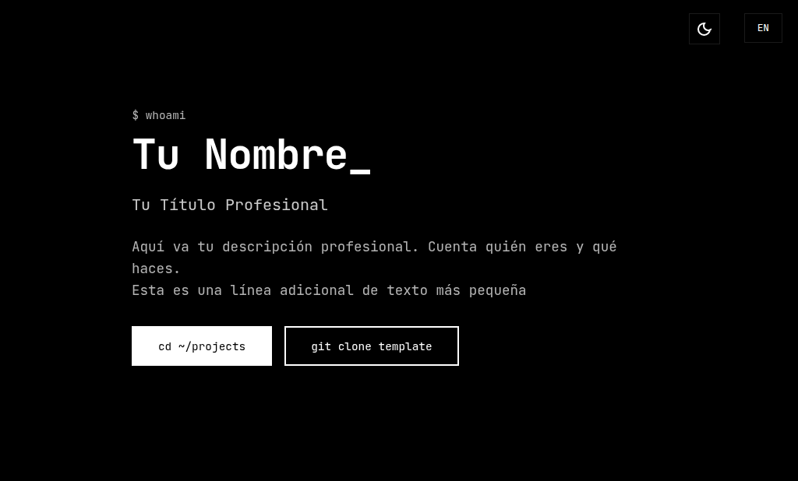
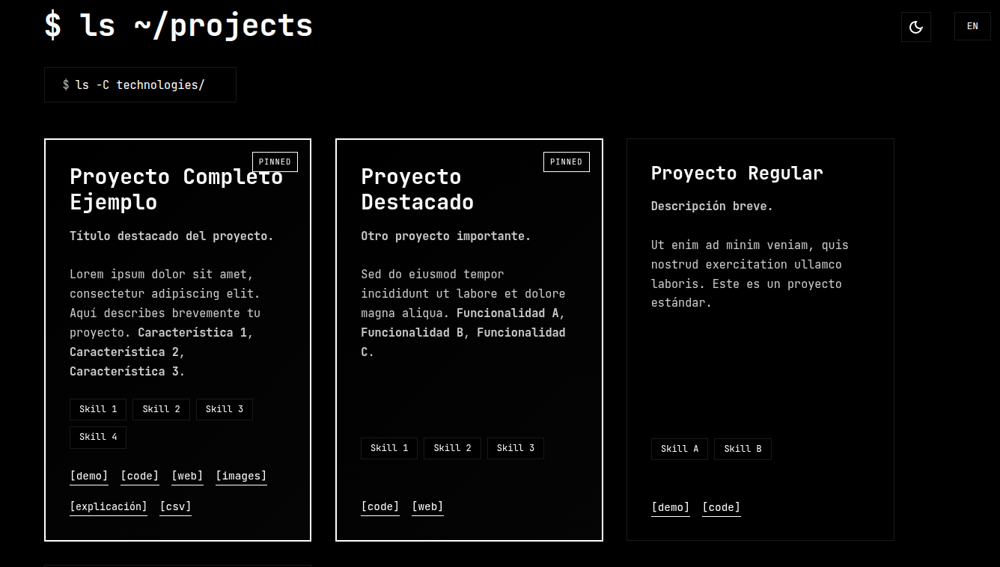
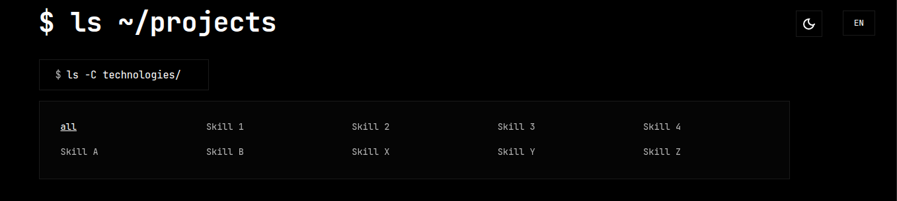

# ASTRO 686F6C61 TEMPLATE

Minimalist portfolio template with terminal-inspired design, automatic dark/light mode, and bilingual support (Spanish/English).

---

## TEMPLATE INFORMATION

> **Information required to publish on Astro.build**

**Theme name:** Astro 686F6C61 Portfolio Template

**GitHub Repository:** https://github.com/686f6c61/astro-686f6c61-template

**Online Demo:** https://astro-686f6c61-template.onrender.com

**Description:**
Minimalist tech portfolio template with terminal-inspired design, automatic dark/light mode, and bilingual support (Spanish/English). Features project showcase with filtering, image galleries, and SEO optimization.

**Tags:**
`portfolio` `dark-mode` `bilingual` `minimal` `terminal` `seo` `typescript` `responsive` `i18n` `tech-portfolio`

**Template Screenshots:**


*Hero section with terminal-inspired design*


*Projects showcase with filtering system*


*Project card with multiple action buttons*


*Automatic dark/light mode support*

---

## TABLE OF CONTENTS

- [FEATURES](#features)
- [PREREQUISITES](#prerequisites)
- [INSTALLATION](#installation)
- [INITIAL CONFIGURATION](#initial-configuration)
- [TRANSLATION SYSTEM](#translation-system)
- [CONTENT CUSTOMIZATION](#content-customization)
- [PROJECTS](#projects)
- [IMAGES AND THUMBNAILS](#images-and-thumbnails)
- [SKILLS SYSTEM](#skills-system)
- [COMPONENTS](#components)
- [STYLES CUSTOMIZATION](#styles-customization)
- [DEPLOYMENT](#deployment)

---

## FEATURES

- Terminal-inspired design with monospace aesthetics
- Automatic dark/light mode based on system preferences
- Complete bilingual system (Spanish/English)
- Project showcase with multiple viewing options
- Anti-spam email protection with Base64 encoding
- SEO optimized with complete meta tags
- Static generation with Astro (exceptional performance)
- Mobile-first responsive design
- Image gallery for projects
- Technology filtering system
- Modals for extended explanations

---

## PREREQUISITES

Before you begin, make sure you have installed:

- **Node.js** version 18 or higher
- **npm**, **yarn** or **pnpm** (package manager)
- Code editor (recommended: VS Code)
- Terminal or command line

To check your Node.js version:

```bash
node --version
```

---

## INSTALLATION

### STEP 1: CLONE THE REPOSITORY

```bash
git clone https://github.com/686f6c61/astro-686f6c61-template.git
cd astro-686f6c61-template
```

### STEP 2: INSTALL DEPENDENCIES

```bash
npm install
```

This command will install:
- Astro 5.15.3
- Serve (for preview)
- Terser (for minification)

### STEP 3: START DEVELOPMENT SERVER

```bash
npm run dev
```

The site will be available at `http://localhost:4321`

### AVAILABLE COMMANDS

| Command | Description |
|---------|-------------|
| `npm install` | Installs all dependencies |
| `npm run dev` | Starts development server on port 4321 |
| `npm run build` | Generates static site in `dist/` folder |
| `npm run preview` | Previews production build |
| `npm run astro` | Runs Astro CLI commands |

---

## INITIAL CONFIGURATION

### ASTRO CONFIGURATION

**File:** `astro.config.mjs`

```javascript
export default defineConfig({
  site: 'https://your-domain.com', // CHANGE: Your domain
  devToolbar: {
    enabled: false  // Development toolbar disabled
  },
  build: {
    inlineStylesheets: 'auto',  // CSS optimization
  },
  vite: {
    build: {
      cssMinify: true,    // CSS minification
      minify: 'terser',   // Minification with Terser
    },
  },
});
```

**WHAT TO CHANGE:**

**File: `astro.config.mjs` - Line 6**

Replace `'https://your-domain.com'` with your actual domain.

Example:
```javascript
site: 'https://myportfolio.com',
```

### SITEMAP CONFIGURATION

**File:** `public/robots.txt` - **Line 5**

```
Sitemap: https://your-domain.com/sitemap.xml
```

CHANGE `your-domain.com` to your domain.

### PACKAGE.JSON

**File:** `package.json`

```json
{
  "name": "astro-686f6c61-template",  // Line 2: Your project name
  "version": "1.0.0",                 // Line 4: Version
  "description": "...",               // Line 5: Description
  "author": "Your Name",              // Line 6: Your name
}
```

**Lines to customize:**
- **Line 2:** Your project name
- **Line 4:** Version
- **Line 5:** Description
- **Line 6:** Your name

---

## TRANSLATION SYSTEM

The template uses a complete bilingual system. **Every text you modify in Spanish must also be modified in English.**

**File:** `src/i18n/translations.ts`

### TRANSLATION STRUCTURE

**File:** `src/i18n/translations.ts`

```typescript
export const translations: Record<string, Translations> = {
  es: {
    // All translations in SPANISH
    siteTitle: "Your Name - Tech Portfolio",
    heroTitle: "Your Name",
    // ...
  },
  en: {
    // The SAME translations in ENGLISH
    siteTitle: "Your Name - Tech Portfolio",
    heroTitle: "Your Name",
    // ...
  }
};
```

### TRANSLATION FIELDS

| Field | Location | Description |
|-------|----------|-------------|
| `siteTitle` | Meta tags | Page title (appears in browser tab) |
| `siteDescription` | Meta tags | Description for SEO |
| `heroGreeting` | Hero section | Text "$ whoami" |
| `heroTitle` | Hero section | Your name or personal brand |
| `heroSubtitle` | Hero section | Your professional title |
| `heroDescription` | Hero section | Description of who you are |
| `heroCta` | Hero section | Button text "cd ~/projects" |
| `heroTemplateButton` | Hero section | Button text "git clone template" |
| `projectsTitle` | Projects | Section title "$ ls ~/projects" |
| `projectsFeatured` | Projects | Badge "PINNED" |
| `projectsDemo` | Projects | Text "[demo]" |
| `projectsCode` | Projects | Text "[code]" |
| `projectsWeb` | Projects | Text "[web]" |
| `projectsImages` | Projects | Text "[images]" |
| `projectsExplanation` | Projects | Text "[explanation]" |
| `projectsCsv` | Projects | Text "[csv]" |
| `contactTitle` | Footer | Title "$ contact --me" |
| `contactEmailButton` | Footer | Button "cat email.txt" |
| `contactLinks` | Footer | Title "Links" |
| `footerCopyright` | Footer | Copyright with {year} as placeholder |
| `footerStatus` | Footer | Status "All systems operational" |

### CUSTOMIZATION EXAMPLE

**File:** `src/i18n/translations.ts`

**Spanish (lines 100-102):**

```typescript
es: {
  siteTitle: "Juan Pérez - Portfolio Tech",
  siteDescription: "Full Stack Developer specialized in React and Node.js",

  heroTitle: "Juan Pérez",
  heroSubtitle: "Full Stack Developer",
  heroDescription: "I develop modern and scalable web applications with over 5 years of experience.<br><span class=\"terminal-info\">Specialized in React, Node.js and cloud computing</span>",
```

**English (lines 139-141):**

```typescript
en: {
  siteTitle: "Juan Pérez - Tech Portfolio",
  siteDescription: "Full Stack Developer specialized in React and Node.js",

  heroTitle: "Juan Pérez",
  heroSubtitle: "Full Stack Developer",
  heroDescription: "I build modern and scalable web applications with over 5 years of experience.<br><span class=\"terminal-info\">Specialized in React, Node.js and cloud computing</span>",
```

**IMPORTANT:** Comments with `//` in the file are guides, they do NOT affect functionality.

---

## CONTENT CUSTOMIZATION

### HERO SECTION (MAIN SECTION)

**File:** `src/i18n/translations.ts`

#### NAME AND TITLE

**File:** `src/i18n/translations.ts`

**Spanish - Lines 100-101:**

```typescript
heroTitle: "Your Name",              // YOUR NAME HERE
heroSubtitle: "Your Professional Title",  // YOUR TITLE HERE
```

**English - Lines 139-140:**

```typescript
heroTitle: "Your Name",                  // YOUR NAME HERE
heroSubtitle: "Your Professional Title", // YOUR TITLE HERE
```

#### DESCRIPTION

**File:** `src/i18n/translations.ts` - **Line 102 (Spanish):**

```typescript
heroDescription: "Here goes your professional description. Tell who you are and what you do.<br><span class=\"terminal-info\">This is an additional line of smaller text</span>",
```

**Description structure:**
- Main text: Goes before the `<br>`
- Secondary text: Goes inside the `<span class="terminal-info">`

**Real example:**

```typescript
heroDescription: "Full Stack Developer with a passion for creating exceptional web experiences.<br><span class=\"terminal-info\">I transform ideas into functional and elegant digital products</span>",
```

### TEMPLATE BUTTON

**File:** `src/components/Hero.astro` - **Line 142:**

```astro
<a href="https://github.com/yourusername/your-template-repo" ...>
```

CHANGE the URL to:
- Your GitHub repository where you publish the template
- Or delete this entire line if you don't want to share the template

### FOOTER

#### SOCIAL NETWORKS

**File:** `src/components/Footer.astro` - **Line 82:**

```typescript
const socialLinks = [
  { name: "GitHub", url: "https://github.com/yourusername" },
  { name: "Twitter", url: "https://twitter.com/yourusername" },
  { name: "LinkedIn", url: "https://linkedin.com/in/yourusername" }
];
```

**You can:**
- Change the URLs
- Add more social networks
- Remove those you don't use

**Example with more networks:**

```typescript
const socialLinks = [
  { name: "GitHub", url: "https://github.com/yourusername" },
  { name: "LinkedIn", url: "https://linkedin.com/in/yourusername" },
  { name: "Twitter", url: "https://twitter.com/yourusername" },
  { name: "Instagram", url: "https://instagram.com/yourusername" },
  { name: "YouTube", url: "https://youtube.com/@yourusername" }
];
```

#### EMAIL (ANTI-SPAM PROTECTION)

The email is encoded in Base64 to avoid spam bots.

**File:** `src/components/Footer.astro` - **Lines 517-518:**

```javascript
const user = atob('eW91cnVzZXJuYW1l');    // Base64 of "yourusername"
const domain = atob('ZXhhbXBsZS5jb20=');  // Base64 of "example.com"
const email = user + '@' + domain;        // Result: yourusername@example.com
```

**HOW TO ENCODE YOUR EMAIL:**

1. Separate your email into two parts: `user@domain.com`
2. Encode each part in Base64:

```bash
# In terminal (Linux/Mac):
echo -n "youremail" | base64
echo -n "yourdomain.com" | base64

# In terminal (Windows PowerShell):
[Convert]::ToBase64String([Text.Encoding]::UTF8.GetBytes("youremail"))
[Convert]::ToBase64String([Text.Encoding]::UTF8.GetBytes("yourdomain.com"))
```

3. Replace the values:

```javascript
const user = atob('eW91cmVtYWls');           // Base64 of "youremail"
const domain = atob('eW91cmRvbWFpbi5jb20='); // Base64 of "yourdomain.com"
```

**Online tool:** https://www.base64encode.org/

#### COPYRIGHT

**File:** `src/i18n/translations.ts`

**Spanish - Line 122:**

```typescript
footerCopyright: "© {year} Your Name",
```

**English - Line 161:**

```typescript
footerCopyright: "© {year} Your Name",
```

The `{year}` is automatically replaced with the current year.

### META TAGS AND SEO

**File:** `src/layouts/Layout.astro`

#### DEFAULT DESCRIPTION

**File:** `src/layouts/Layout.astro` - **Line 57:**

```typescript
description = "Tech portfolio - Full stack developer",
```

Change this to your default description.

#### OPEN GRAPH

**File:** `src/layouts/Layout.astro` - **Line 183:**

```html
<meta property="og:site_name" content="Your Portfolio" />
```

Change "Your Portfolio" to your site name.

#### TWITTER

**File:** `src/layouts/Layout.astro` - **Line 206:**

```html
<meta name="twitter:creator" content="@yourusername" />
```

Change `@yourusername` to your Twitter/X username.

#### JSON-LD (STRUCTURED DATA)

**File:** `src/layouts/Layout.astro` - **Lines 256-276:**

```javascript
{
  "@context": "https://schema.org",
  "@type": "Person",
  "name": "Your Name",           // CHANGE: Your name (line 259)
  "url": Astro.site?.toString(),
  "image": ogImage.toString(),
  "sameAs": [                    // CHANGE: Your social networks
    "https://github.com/yourusername",
    "https://twitter.com/yourusername"
  ],
  "jobTitle": "Full Stack Developer",  // CHANGE: Your title (line 266)
  "description": description,
  "knowsAbout": [                // CHANGE: Your technologies (line 268)
    "React",
    "Node.js",
    "Astro",
    "TypeScript",
    "Python",
    "Full Stack Development"
  ]
}
```

#### GOOGLE ANALYTICS (OPTIONAL)

**File:** `src/layouts/Layout.astro` - **Lines 295-301:**

The code is commented out. To activate it:

1. Get your tracking ID from Google Analytics (format: G-XXXXXXXXXX)
2. Uncomment the code
3. Replace `G-XXXXXXXXXX` with your ID

```html
<script async src="https://www.googletagmanager.com/gtag/js?id=G-YOUR-ID-HERE"></script>
<script>
  window.dataLayer = window.dataLayer || [];
  function gtag(){dataLayer.push(arguments);}
  gtag('js', new Date());
  gtag('config', 'G-YOUR-ID-HERE');
</script>
```

### FAVICON

The favicon is the small icon that appears in the browser tab next to your site title.

#### FAVICON FILES

The template includes two favicon formats:

**File:** `public/favicon.ico` - Traditional ICO format (32x32px)
**File:** `public/favicon.svg` - Vector SVG format (scalable)

#### CHANGE FAVICON ICO

**File:** `public/favicon.ico`

1. Create a 32x32 pixel PNG file with your logo/initial
2. Convert to ICO format using:
   - **Online:** https://favicon.io/ or https://www.favicon-generator.org/
   - **Photoshop/GIMP:** Export as ICO
   - **ImageMagick:**
   ```bash
   convert my-logo.png -resize 32x32 favicon.ico
   ```

3. Replace the `public/favicon.ico` file with your new favicon

#### CHANGE FAVICON SVG

**File:** `public/favicon.svg`

SVG allows scalable favicons that adapt to theme (light/dark).

**Option 1: Simple SVG with initial**

```svg
<svg xmlns="http://www.w3.org/2000/svg" viewBox="0 0 100 100">
  <!-- Background rectangle -->
  <rect width="100" height="100" fill="#000000"/>
  <!-- Your initial in white -->
  <text x="50" y="70" font-family="monospace" font-size="60"
        fill="#ffffff" text-anchor="middle">J</text>
</svg>
```

**Option 2: SVG adaptable to light/dark theme**

```svg
<svg xmlns="http://www.w3.org/2000/svg" viewBox="0 0 100 100">
  <style>
    rect { fill: #000000; }
    text { fill: #ffffff; }
    @media (prefers-color-scheme: light) {
      rect { fill: #ffffff; }
      text { fill: #000000; }
    }
  </style>
  <rect width="100" height="100"/>
  <text x="50" y="70" font-family="monospace" font-size="60" text-anchor="middle">J</text>
</svg>
```

**Option 3: Use your existing logo**

If you have a logo in SVG, simply copy it to `public/favicon.svg`.

#### TOOLS FOR CREATING FAVICONS

| Tool | URL | Description |
|------|-----|-------------|
| Favicon.io | https://favicon.io/ | Generate from text, image or emoji |
| RealFaviconGenerator | https://realfavicongenerator.net/ | Generate multiple formats |
| Figma | https://www.figma.com/ | Design and export custom SVG |
| Inkscape | https://inkscape.org/ | Free SVG editor |

#### RECOMMENDED SIZES

| Format | Size | Use |
|--------|------|-----|
| favicon.ico | 32x32px | Legacy browsers, bookmarks |
| favicon.svg | Vector | Modern browsers, scalable |
| apple-touch-icon | 180x180px | iOS home screen (optional) |
| android-chrome | 192x192px | Android home screen (optional) |

#### ADD APPLE TOUCH ICON (OPTIONAL)

If you want support for when users add your site to the home screen on iOS:

1. Create a 180x180px PNG image
2. Save it as `public/apple-touch-icon.png`
3. Add to `src/layouts/Layout.astro` after line 218 (after favicons):

```html
<link rel="apple-touch-icon" sizes="180x180" href="/apple-touch-icon.png" />
```

#### VERIFY FAVICON

After changing the favicon:

1. **Clear browser cache:** Ctrl+Shift+R (Cmd+Shift+R on Mac)
2. **Test in incognito mode** to see the new favicon
3. **Check in multiple browsers** (Chrome, Firefox, Safari)
4. **Use this tool:** https://realfavicongenerator.net/favicon_checker

#### COMPLETE CONFIGURATION EXAMPLE

**Recommended structure in `public/`:**

```
public/
├── favicon.ico          # 32x32 ICO (required)
├── favicon.svg          # Scalable SVG (required)
├── apple-touch-icon.png # 180x180 PNG (optional)
└── android-chrome-192x192.png # 192x192 PNG (optional)
```

**References in Layout.astro:**

The template already includes the correct references in `src/layouts/Layout.astro` lines 218-219:

```html
<link rel="icon" type="image/x-icon" href="/favicon.ico" />
<link rel="shortcut icon" href="/favicon.ico" />
```

---

## PROJECTS

This is the most important section of the template. Here you define all your projects.

**File:** `src/data/projects-data.ts`

### PROJECT STRUCTURE

Each project is a JavaScript object with the following structure:

```typescript
{
  title: {
    es: "Spanish Title",
    en: "English Title"
  },
  description: {
    es: "Spanish description with <strong>HTML</strong> allowed",
    en: "English description with <strong>HTML</strong> allowed"
  },
  explanation: {  // OPTIONAL
    es: "Extended explanation in Spanish",
    en: "Extended explanation in English"
  },
  tech: ["Technology 1", "Technology 2", "Technology 3"],
  link: "URL" or null,
  demo: "URL" or null,
  web: "URL" or null,
  csv: "path" or null,
  featured: true or false,
  images: ["path1", "path2"] or null
}
```

### PROPERTIES TABLE

| Property | Type | Required | Description | Example |
|----------|------|----------|-------------|---------|
| `title` | Object | YES | Project title in both languages | `{es: "My App", en: "My App"}` |
| `description` | Object | YES | Brief description (HTML allowed) | `{es: "<strong>Web app</strong>...", en: "..."}` |
| `explanation` | Object | NO | Extended description for modal | `{es: "Details...", en: "Details..."}` |
| `tech` | Array | YES | List of technologies/skills | `["React", "Node", "MongoDB"]` |
| `link` | String/null | NO | Code URL (GitHub) | `"https://github.com/user/repo"` |
| `demo` | String/null | NO | Live demo URL | `"https://demo.myapp.com"` |
| `web` | String/null | NO | Website URL | `"https://www.myapp.com"` |
| `csv` | String/null | NO | Path to downloadable file | `"/assets/data/file.csv"` |
| `featured` | Boolean | YES | Appears as PINNED | `true` or `false` |
| `images` | Array/null | NO | Image paths for gallery | `["/screenshots/project/img1"]` |

### DETAILED PROPERTY DESCRIPTION

#### TITLE

Appears as project header.

```typescript
title: {
  es: "Inventory Management",
  en: "Inventory Management"
}
```

#### DESCRIPTION

Text that appears in the project card. Supports HTML.

**Recommendations:**
- Use `<strong>` to highlight keywords
- Use `<br><br>` to separate paragraphs
- Maximum recommended: 150-200 words

```typescript
description: {
  es: "<strong>Complete management system.</strong><br><br>Web application to manage inventories in real time. Includes reports, low stock alerts and multi-store synchronization. <strong>Dashboard</strong>, <strong>PDF Reports</strong>, <strong>REST API</strong>.",
  en: "<strong>Complete management system.</strong><br><br>Web application for real-time inventory management. Includes reports, low stock alerts and multi-store synchronization. <strong>Dashboard</strong>, <strong>PDF Reports</strong>, <strong>REST API</strong>."
}
```

#### EXPLANATION (Extended Explanation)

OPTIONAL. Detailed description that appears in a modal when clicking `[explanation]`.

Use it for:
- Complex projects that need more context
- Detailing the architecture
- Explaining the development process
- Showing performance metrics

```typescript
explanation: {
  es: "System developed for a 15-store chain.<br><br><strong>Problem:</strong><br>• Manual inventory control<br>• Frequent counting errors<br>• No real-time visibility<br><br><strong>Solution:</strong><br>• Centralized cloud system<br>• Automatic synchronization<br>• Smart alerts<br><br><strong>Results:</strong><br>• 95% error reduction<br>• -70% management time<br>• ROI in 4 months",
  en: "System developed for a 15-store chain.<br><br><strong>Problem:</strong><br>• Manual inventory control<br>• Frequent counting errors<br>• No real-time visibility<br><br><strong>Solution:</strong><br>• Centralized cloud system<br>• Automatic synchronization<br>• Smart alerts<br><br><strong>Results:</strong><br>• 95% error reduction<br>• -70% management time<br>• ROI in 4 months"
}
```

#### TECH (Technologies)

Array of strings with technologies used. Displayed as tags and allow filtering.

```typescript
tech: ["React", "Node.js", "PostgreSQL", "AWS", "Docker", "Redis"]
```

**Recommendations:**
- Use official technology names
- Order from most to least important
- Maximum recommended: 6-8 technologies
- For non-technical skills: `["Project Management", "UX Design"]`

#### LINK (Source code)

URL to GitHub repository (or similar). If `null`, the `[code]` button won't appear.

```typescript
link: "https://github.com/user/my-project",
// or
link: null,  // Doesn't show [code] button
```

#### DEMO (Live demonstration)

URL to a functional demo of the project. If `null`, the `[demo]` button won't appear.

```typescript
demo: "https://my-project-demo.vercel.app",
// or
demo: null,  // Doesn't show [demo] button
```

#### WEB (Website)

URL to the project's official website. If `null`, the `[web]` button won't appear.

```typescript
web: "https://www.my-project.com",
// or
web: null,  // Doesn't show [web] button
```

#### CSV (Downloadable file)

Path to a CSV file (or any downloadable file). If `null`, the `[csv]` button won't appear.

```typescript
csv: "/assets/data/metrics.csv",
// or
csv: null,  // Doesn't show [csv] button
```

The file must be in `public/assets/` to be accessible.

#### FEATURED (Featured)

Boolean that determines if the project appears with "PINNED" badge at the beginning.

```typescript
featured: true,   // Appears first with PINNED badge
// or
featured: false,  // Appears in normal order
```

Projects with `featured: true` are shown before others.

#### IMAGES (Image gallery)

Array of image paths or `null`. If it has images, an `[images]` button appears that opens a gallery.

```typescript
images: [
  "/screenshots/my-project/capture-01",
  "/screenshots/my-project/capture-02",
  "/screenshots/my-project/capture-03"
],
// or
images: null,  // Doesn't show [images] button
```

**Note:** Extensions (.png, .jpg, etc.) are added automatically.

### AVAILABLE BUTTONS

Each project can show up to 6 types of buttons:

| Button | Required property | Description |
|--------|------------------|-------------|
| `[demo]` | `demo: "URL"` | Opens live demo in new tab |
| `[code]` | `link: "URL"` | Opens GitHub repository in new tab |
| `[web]` | `web: "URL"` | Opens website in new tab |
| `[images]` | `images: [...]` | Opens image gallery modal |
| `[explanation]` | `explanation: {...}` | Opens modal with extended description |
| `[csv]` | `csv: "path"` | Downloads CSV file |

### PROJECT TYPES (EXAMPLES)

The `src/data/projects-data.ts` file includes 4 example project types:

#### TYPE 1: COMPLETE PROJECT

**File:** `src/data/projects-data.ts` - **Lines 144-183**

Shows ALL available options:

```typescript
{
  title: { es: "Complete Example Project", en: "Complete Example Project" },
  description: { es: "...", en: "..." },
  explanation: { es: "...", en: "..." },  // ✓ Has explanation
  tech: ["Skill 1", "Skill 2", "Skill 3", "Skill 4"],
  link: "https://github.com/yourusername/repo-name",      // ✓ [code]
  demo: "https://demo.yourproject.com",                   // ✓ [demo]
  web: "https://www.yourproject.com",                     // ✓ [web]
  csv: "/assets/example-data/sample-data.csv",            // ✓ [csv]
  featured: true,                                          // ✓ PINNED
  images: ["/screenshots/example-project/screenshot-01"]  // ✓ [images]
}
```

Shows: `[demo] [code] [web] [images] [explanation] [csv]` + PINNED badge

#### TYPE 2: FEATURED PROJECT

**File:** `src/data/projects-data.ts` - **Lines 184-213**

Only some options:

```typescript
{
  title: { es: "Featured Project", en: "Featured Project" },
  description: { es: "...", en: "..." },
  tech: ["Skill 1", "Skill 2", "Skill 3"],
  link: "https://github.com/yourusername/another-repo",  // ✓ [code]
  demo: null,                                             // ✗ No demo
  web: "https://www.anotherproject.com",                 // ✓ [web]
  csv: null,                                              // ✗ No CSV
  featured: true,                                         // ✓ PINNED
  images: null                                            // ✗ No gallery
}
```

Shows: `[code] [web]` + PINNED badge

#### TYPE 3: REGULAR PROJECT

**File:** `src/data/projects-data.ts` - **Lines 214-242**

Basic project without featuring:

```typescript
{
  title: { es: "Regular Project", en: "Regular Project" },
  description: { es: "...", en: "..." },
  tech: ["Skill A", "Skill B"],
  link: "https://github.com/yourusername/project-repo",  // ✓ [code]
  demo: "https://project-demo.com",                      // ✓ [demo]
  web: null,                                              // ✗ No web
  csv: null,                                              // ✗ No CSV
  featured: false,                                        // ✗ No PINNED
  images: null                                            // ✗ No gallery
}
```

Shows: `[demo] [code]`

#### TYPE 4: SIMPLE PROJECT

**File:** `src/data/projects-data.ts` - **Lines 243-271**

Minimum required:

```typescript
{
  title: { es: "Simple Project", en: "Simple Project" },
  description: { es: "...", en: "..." },
  tech: ["Skill X", "Skill Y", "Skill Z"],
  link: "https://github.com/yourusername/simple-project", // ✓ [code]
  demo: null,                                              // ✗ Everything else null
  web: null,
  csv: null,
  featured: false,                                         // ✗ No PINNED
  images: null
}
```

Shows: `[code]` only

### ADD A NEW PROJECT

**File:** `src/data/projects-data.ts`

1. Open the file `src/data/projects-data.ts`
2. Locate the `projectsData` array (line 142)
3. Add your project at the end, BEFORE the closing `];`

**Example:**

```typescript
export const projectsData: Project[] = [
  // ... existing projects ...

  // YOUR NEW PROJECT HERE
  {
    title: {
      es: "My New App",
      en: "My New App"
    },
    description: {
      es: "<strong>Mobile fitness application.</strong><br><br>App that helps users create personalized exercise routines. <strong>Tracking</strong>, <strong>Statistics</strong>, <strong>Reminders</strong>.",
      en: "<strong>Mobile fitness application.</strong><br><br>App that helps users create personalized exercise routines. <strong>Tracking</strong>, <strong>Statistics</strong>, <strong>Reminders</strong>."
    },
    tech: ["React Native", "Firebase", "Redux"],
    link: "https://github.com/myuser/fitness-app",
    demo: "https://fitness-app-demo.com",
    web: null,
    csv: null,
    featured: true,
    images: null
  }
]; // ← Array closing
```

### DELETE A PROJECT

**File:** `src/data/projects-data.ts`

1. Open the file `src/data/projects-data.ts`
2. Locate the project to delete
3. Delete the ENTIRE object, from `{` to `},`

**Before:**

```typescript
export const projectsData: Project[] = [
  {
    title: { es: "Project 1", en: "Project 1" },
    // ...
  },
  { // ← DELETE FROM HERE
    title: { es: "Project to Delete", en: "Project to Delete" },
    // ...
  }, // ← TO HERE (include comma)
  {
    title: { es: "Project 3", en: "Project 3" },
    // ...
  }
];
```

**After:**

```typescript
export const projectsData: Project[] = [
  {
    title: { es: "Project 1", en: "Project 1" },
    // ...
  },
  {
    title: { es: "Project 3", en: "Project 3" },
    // ...
  }
];
```

---

## IMAGES AND THUMBNAILS

### SUPPORTED FORMATS

The template supports the following image formats:

| Format | Extension | Recommended use |
|--------|-----------|-----------------|
| PNG | `.png` | Screenshots with transparency, logos |
| JPG/JPEG | `.jpg`, `.jpeg` | Photographs, screenshots |
| WebP | `.webp` | Modern format, better compression |
| GIF | `.gif` | Animations (not recommended for screenshots) |
| SVG | `.svg` | Vector logos, icons |

**Recommendation:** Use WebP for better performance, PNG for maximum quality.

### FOLDER STRUCTURE

```
public/
├── screenshots/           # Full-size project images
│   ├── project-1/
│   │   ├── screenshot-01.png
│   │   ├── screenshot-02.png
│   │   └── screenshot-03.png
│   └── project-2/
│       └── screenshot-01.png
├── thumbnails/           # Thumbnails (manually generated)
│   └── screenshots/
│       ├── project-1/
│       │   ├── screenshot-01_thumb.webp
│       │   ├── screenshot-02_thumb.webp
│       │   └── screenshot-03_thumb.webp
│       └── project-2/
│           └── screenshot-01_thumb.webp
└── assets/              # Other files
    └── example-data/
        └── sample-data.csv
```

### ADD PROJECT SCREENSHOTS

#### STEP 1: CREATE FOLDER

Inside `public/screenshots/`, create a folder with your project name (use lowercase and hyphens):

```bash
public/screenshots/my-super-app/
```

#### STEP 2: ADD IMAGES

Copy your screenshots to the folder, naming them sequentially:

```
my-super-app/
├── screenshot-01.png
├── screenshot-02.png
├── screenshot-03.png
└── screenshot-04.png
```

**Recommended specifications:**
- Resolution: 1920x1080 or similar (16:9)
- Maximum weight: 500KB per image
- Format: PNG or WebP
- Names: `screenshot-01`, `screenshot-02`, etc. (no extension in code)

#### STEP 3: REFERENCE IN PROJECT

**File:** `src/data/projects-data.ts`

Add the paths to your project:

```typescript
{
  title: { es: "My Super App", en: "My Super App" },
  // ... other properties ...
  images: [
    "/screenshots/my-super-app/screenshot-01",
    "/screenshots/my-super-app/screenshot-02",
    "/screenshots/my-super-app/screenshot-03",
    "/screenshots/my-super-app/screenshot-04"
  ]
}
```

**NOTE:** DO NOT include the extension (.png, .jpg, etc.) in the path. The system adds it automatically.

### CREATE THUMBNAILS

Thumbnails are small versions of images shown in the gallery for faster loading.

#### OPTION 1: ONLINE TOOLS

Use services like:
- TinyPNG: https://tinypng.com/
- Squoosh: https://squoosh.app/
- ImageOptim (Mac): https://imageoptim.com/

**Recommended configuration:**
- Width: 300px
- Quality: 70-80%
- Format: WebP

#### OPTION 2: COMMAND (Linux/Mac)

Install ImageMagick:

```bash
# Mac
brew install imagemagick

# Ubuntu/Debian
sudo apt-get install imagemagick
```

Create thumbnails automatically:

```bash
# Navigate to project folder
cd public/screenshots/my-super-app/

# Create thumbnails
for img in *.png; do
  convert "$img" -resize 300x -quality 80 -format webp "../../../public/thumbnails/screenshots/my-super-app/${img%.png}_thumb.webp"
done
```

#### OPTION 3: NODE.JS SCRIPT

Create a `generate-thumbnails.js` file in the root:

```javascript
// generate-thumbnails.js
const sharp = require('sharp');
const fs = require('fs');
const path = require('path');

const projectName = 'my-super-app'; // CHANGE
const inputDir = `public/screenshots/${projectName}`;
const outputDir = `public/thumbnails/screenshots/${projectName}`;

// Create directory if it doesn't exist
if (!fs.existsSync(outputDir)) {
  fs.mkdirSync(outputDir, { recursive: true });
}

// Process images
fs.readdirSync(inputDir).forEach(file => {
  if (file.match(/\.(jpg|jpeg|png)$/i)) {
    const input = path.join(inputDir, file);
    const output = path.join(outputDir, file.replace(/\.(jpg|jpeg|png)$/i, '_thumb.webp'));

    sharp(input)
      .resize(300)
      .webp({ quality: 80 })
      .toFile(output)
      .then(() => console.log(`✓ ${file} -> thumbnail`))
      .catch(err => console.error(`✗ ${file}:`, err));
  }
});
```

Install dependency and run:

```bash
npm install sharp
node generate-thumbnails.js
```

### FINAL STRUCTURE

After adding screenshots and thumbnails, you should have:

```
public/
├── screenshots/
│   └── my-super-app/
│       ├── screenshot-01.png   (original image)
│       ├── screenshot-02.png
│       └── screenshot-03.png
└── thumbnails/
    └── screenshots/
        └── my-super-app/
            ├── screenshot-01_thumb.webp   (thumbnail)
            ├── screenshot-02_thumb.webp
            └── screenshot-03_thumb.webp
```

### IMAGE OPTIMIZATION

**Before uploading images, optimize them:**

1. **Reduce resolution** if greater than 1920x1080
2. **Compress** using tools like TinyPNG
3. **Convert to WebP** for better performance
4. **Remove metadata** unnecessary EXIF

**Recommended sizes:**

| Type | Resolution | Maximum weight |
|------|------------|----------------|
| Full screenshot | 1920x1080 | 500 KB |
| Thumbnail | 300px width | 50 KB |
| OG Image | 1200x630 | 300 KB |
| Favicon | 32x32 | 10 KB |

---

## SKILLS SYSTEM

Skills (technologies) are automatically extracted from projects and allow filtering.

### HOW THEY WORK

1. The system reads all `tech` arrays from your projects
2. Extracts unique skills
3. Shows them as filter buttons
4. When clicked, filters projects that use that skill

### ADD SKILLS TO A PROJECT

**File:** `src/data/projects-data.ts`

```typescript
{
  title: { es: "My Project", en: "My Project" },
  tech: ["React", "TypeScript", "Tailwind CSS", "Supabase"],
  // ... other properties
}
```

### BEST PRACTICES

1. **Use standard names:**
   - ✓ "React"
   - ✗ "react.js" or "React.js"

2. **Be consistent:**
   - If you use "Node.js" in one project, use it the same way in ALL

3. **Order by importance:**
   ```typescript
   tech: ["React", "TypeScript", "Node.js", "PostgreSQL"]
   // Main technology first
   ```

4. **Don't exceed 8 skills per project:**
   - Too many skills dilute the message

5. **Use correct capitalization:**
   - ✓ "JavaScript", "TypeScript", "MongoDB"
   - ✗ "javascript", "typescript", "mongodb"

### RECOMMENDED SKILLS BY CATEGORY

**Frontend:**
- React, Vue.js, Angular, Svelte
- TypeScript, JavaScript
- HTML, CSS, Sass, Tailwind CSS
- Next.js, Nuxt.js, Astro

**Backend:**
- Node.js, Express, Fastify
- Python, Django, Flask, FastAPI
- Ruby, Rails
- PHP, Laravel
- Go, Rust

**Databases:**
- PostgreSQL, MySQL, MongoDB
- Redis, Supabase, Firebase
- Prisma, TypeORM

**Cloud/DevOps:**
- AWS, Google Cloud, Azure
- Docker, Kubernetes
- Vercel, Netlify, Render

**Mobile:**
- React Native, Flutter
- Swift, Kotlin
- Expo

### CUSTOMIZE FILTER TEXT

**File:** `src/components/Projects.astro`

Find the line containing "ls -C technologies/":

```astro
<span class="command" data-astro-cid-amng4zvp>ls -C technologies/</span>
```

You can change the command text that appears in the filter.

---

## COMPONENTS

The template is divided into reusable components.

### COMPONENT LIST

| Component | File | Description |
|-----------|------|-------------|
| Layout | `src/layouts/Layout.astro` | Main layout with meta tags |
| Hero | `src/components/Hero.astro` | Main section with name and description |
| Projects | `src/components/Projects.astro` | Project gallery with filters |
| Footer | `src/components/Footer.astro` | Footer with contact and social networks |
| ThemeToggle | `src/components/ThemeToggle.astro` | Light/dark mode toggle button |
| LanguageSwitcher | `src/components/LanguageSwitcher.astro` | ES/EN language selector |
| ImageGallery | `src/components/ImageGallery.astro` | Image gallery modal |

### LAYOUT

**File:** `src/layouts/Layout.astro`

Contains:
- Meta tags (SEO, Open Graph, Twitter)
- Alternate language links
- Base HTML structure
- Global styles import
- Google Analytics scripts (optional)
- JSON-LD for structured data

**You don't need to modify this file** unless you want to change advanced meta tags.

### HERO COMPONENT

**File:** `src/components/Hero.astro`

Visual structure of the main section. Translations are obtained from `src/i18n/translations.ts`.

**Important lines:**

- **File:** `src/components/Hero.astro` - **Line 142:** URL of the "git clone template" button

**Modifiable styles:**

```css
/* Hero minimum height */
.hero {
  min-height: 90vh;  /* Change if you want more/less height */
}

/* Blinking cursor speed */
@keyframes blink {
  0%, 50% { opacity: 1; }
  51%, 100% { opacity: 0; }
}
```

### PROJECTS COMPONENT

**File:** `src/components/Projects.astro`

Most complex component. Manages:
- Reading projects from `projects-data.ts`
- Filtering by technologies
- Card rendering
- Gallery modals
- Explanation modals

**You don't need to modify it** unless you want to change the design.

### FOOTER COMPONENT

**File:** `src/components/Footer.astro`

**Important lines:**

- **File:** `src/components/Footer.astro` - **Line 82:** Social networks array
- **File:** `src/components/Footer.astro` - **Lines 517-518:** Base64 encoded email

**Add new social network:**

```typescript
const socialLinks = [
  { name: "GitHub", url: "https://github.com/youruser" },
  { name: "Dribbble", url: "https://dribbble.com/youruser" }, // NEW
];
```

### THEME TOGGLE

**File:** `src/components/ThemeToggle.astro`

Button that switches between light and dark mode.

**Position:**

**File:** `src/components/ThemeToggle.astro` - **Line 107:**

```css
#theme-toggle {
  position: fixed;
  top: 2rem;    /* Distance from top */
  right: 7rem;  /* Distance from right */
}
```

### LANGUAGE SWITCHER

**File:** `src/components/LanguageSwitcher.astro`

Button that switches between ES/EN.

**Position:**

**File:** `src/components/LanguageSwitcher.astro` - **Line 234:**

```css
.language-switcher {
  position: fixed;
  top: 2rem;   /* Distance from top */
  right: 2rem; /* Distance from right */
}
```

### IMAGE GALLERY

**File:** `src/components/ImageGallery.astro`

Modal that shows image gallery with:
- Prev/next navigation
- Clickable thumbnails
- Close with X or click outside

**You don't need to modify it.**

---

## STYLES CUSTOMIZATION

### GLOBAL STYLES FILE

**File:** `src/styles/global.css`

### CSS VARIABLES

**File:** `src/styles/global.css`

**Light mode - Lines 52-59:**

```css
:root {
  --bg: #ffffff;      /* Background color */
  --text: #000000;    /* Text color */
  --accent: #111111;  /* Accent color */
  --border: #e5e5e5;  /* Border color */
  --mono: 'JetBrains Mono', 'Fira Code', 'Courier New', monospace;
}
```

**Dark mode - Lines 74-80:**

```css
@media (prefers-color-scheme: dark) {
  :root:not([data-theme="light"]) {
    --bg: #000000;      /* Dark background */
    --text: #ffffff;    /* Light text */
    --accent: #eeeeee;  /* Light accent */
    --border: #1a1a1a;  /* Dark borders */
  }
}
```

### CHANGE COLORS

**Example: Blue theme**

```css
:root {
  --bg: #f0f4f8;      /* Very light blue background */
  --text: #1a202c;    /* Dark blue text */
  --accent: #2c5282;  /* Blue accent */
  --border: #cbd5e0;  /* Bluish gray border */
}

@media (prefers-color-scheme: dark) {
  :root:not([data-theme="light"]) {
    --bg: #1a202c;      /* Dark blue background */
    --text: #f7fafc;    /* Almost white text */
    --accent: #63b3ed;  /* Light blue accent */
    --border: #2d3748;  /* Dark gray border */
  }
}
```

### CHANGE FONT

**File:** `src/styles/global.css` - **Line 57:**

```css
--mono: 'JetBrains Mono', 'Fira Code', 'Courier New', monospace;
```

**Popular options:**

```css
/* System font */
--mono: ui-monospace, 'SF Mono', 'Monaco', monospace;

/* Fira Code (if you import it) */
--mono: 'Fira Code', monospace;

/* Roboto Mono */
--mono: 'Roboto Mono', monospace;

/* Source Code Pro */
--mono: 'Source Code Pro', monospace;
```

**To use custom font,** add it in:

**File:** `src/layouts/Layout.astro` - **Line 238:**

```html
<link href="https://fonts.googleapis.com/css2?family=Fira+Code:wght@400;700&display=swap" rel="stylesheet" />
```

### TEXT SIZES

**File:** `src/styles/global.css` - **Lines 213-251:**

```css
h1 {
  font-size: clamp(2rem, 5vw, 4rem);  /* Min: 2rem, Max: 4rem */
}

h2 {
  font-size: clamp(1.5rem, 3vw, 2.5rem);
}

h3 {
  font-size: 1.25rem;
}
```

### ANIMATIONS

**File:** `src/styles/global.css`

**Fade-in speed - Lines 505-514:**

```css
@keyframes fadeIn {
  from {
    opacity: 0;
    transform: translateY(20px);  /* Movement distance */
  }
  to {
    opacity: 1;
    transform: translateY(0);
  }
}
```

### BORDERS AND SHADOWS

**File:** `src/styles/global.css`

The template uses simple borders. To add shadows, modify:

```css
.project-card {
  border: 1px solid var(--border);
  box-shadow: 0 2px 8px rgba(0, 0, 0, 0.1);  /* NEW LINE */
  transition: all 0.3s;
}

.project-card:hover {
  box-shadow: 0 4px 16px rgba(0, 0, 0, 0.15);  /* NEW LINE */
}
```

### ROUNDED CORNERS

**File:** `src/styles/global.css`

By default, the template does NOT use border-radius (square design). To add it:

```css
.project-card,
.btn-primary,
.btn-secondary,
.filter-btn {
  border-radius: 8px;  /* ADD */
}
```

---

## DEPLOYMENT

The template generates a static site that can be deployed on any hosting service.

### PRODUCTION BUILD

```bash
npm run build
```

This generates a `dist/` folder with:
- Static HTML
- Minified CSS
- Optimized JavaScript
- Images and assets

### PREVIEW BUILD

```bash
npm run preview
```

Opens the build at `http://localhost:4321` to verify before deploying.

### VERCEL

1. Create account at https://vercel.com
2. Connect your GitHub repository
3. Vercel detects Astro automatically
4. Click "Deploy"

**Configuration (if needed):**

```
Framework Preset: Astro
Build Command: npm run build
Output Directory: dist
Install Command: npm install
```

### NETLIFY

#### OPTION A: Drag & Drop

1. Run `npm run build`
2. Drag `dist/` folder to https://app.netlify.com/drop

#### OPTION B: GitHub

1. Connect repository at https://app.netlify.com
2. Configuration:

```
Build command: npm run build
Publish directory: dist
```

### GITHUB PAGES

1. Create file `.github/workflows/deploy.yml`:

```yaml
name: Deploy to GitHub Pages

on:
  push:
    branches: [ main ]

permissions:
  contents: read
  pages: write
  id-token: write

jobs:
  build:
    runs-on: ubuntu-latest
    steps:
      - name: Checkout
        uses: actions/checkout@v3

      - name: Setup Node
        uses: actions/setup-node@v3
        with:
          node-version: 18

      - name: Install dependencies
        run: npm install

      - name: Build
        run: npm run build

      - name: Upload artifact
        uses: actions/upload-pages-artifact@v1
        with:
          path: ./dist

  deploy:
    environment:
      name: github-pages
      url: ${{ steps.deployment.outputs.page_url }}
    runs-on: ubuntu-latest
    needs: build
    steps:
      - name: Deploy to GitHub Pages
        id: deployment
        uses: actions/deploy-pages@v1
```

2. In Settings > Pages: Source = "GitHub Actions"
3. Push to main and it deploys automatically

**IMPORTANT:** If your site is at `user.github.io/repo`, update:

**File:** `astro.config.mjs`

```javascript
export default defineConfig({
  site: 'https://user.github.io',
  base: '/repo',  // ADD THIS LINE
});
```

### CLOUDFLARE PAGES

1. Connect repository at https://dash.cloudflare.com/pages
2. Configuration:

```
Framework preset: Astro
Build command: npm run build
Build output directory: dist
```

### RENDER

Render offers two deployment options: automatic with `render.yaml` or manual. **We recommend the automatic option.**

#### OPTION A: Automatic Deployment (Recommended)

The template includes a pre-configured `render.yaml` file for automatic deployment.

1. **Create Render account**
   - Go to https://render.com and create an account
   - Connect your GitHub account

2. **Create new Static Site**
   - Click "New +" → "Static Site"
   - Connect your GitHub repository
   - Render will automatically detect the `render.yaml` file

3. **Deploy**
   - Click "Create Static Site"
   - Render will automatically detect the configuration:
     - Build Command: `npm install && npm run build`
     - Publish Directory: `dist`
     - Node Version: 18
   - Deployment starts automatically

4. **Verify deployment**
   - Render will give you a URL: `https://your-project.onrender.com`
   - The site will automatically redeploy with each push to the main branch

**render.yaml configuration:**

```yaml
services:
  - type: web
    name: astro-686f6c61-template
    runtime: static
    buildCommand: npm install && npm run build
    staticPublishPath: ./dist
    envVars:
      - key: NODE_VERSION
        value: 18
```

#### OPTION B: Manual Deployment

If you prefer manual configuration:

1. **Create new Static Site**
   - Go to https://render.com
   - Click "New +" → "Static Site"
   - Connect your repository

2. **Manual configuration:**
   ```
   Name: astro-686f6c61-template
   Build Command: npm install && npm run build
   Publish Directory: dist
   ```

3. **Environment variables (optional):**
   ```
   NODE_VERSION: 18
   ```

4. **Deploy**
   - Click "Create Static Site"
   - Wait for build to finish (2-3 minutes)

#### Auto-Deploy with Git

Render automatically redeploys when:
- You push to the main branch
- You merge a pull request
- You update the connected repository

**Render advantages:**
- Automatic deployment with `render.yaml`
- Free SSL/HTTPS
- Global CDN included
- Auto-deploy on every push
- Preview environments for PRs
- 100GB bandwidth free/month
- Custom headers (cache)

### POST-DEPLOYMENT CONFIGURATION

After deploying, update:

1. **File:** `astro.config.mjs` - **Line 6:** Your real domain
2. **File:** `src/i18n/translations.ts` - URLs if they change
3. **File:** `src/layouts/Layout.astro` - **Google Analytics** (if you use it): Verify the tracking ID is correct

### CUSTOM DOMAIN

**Vercel:**
1. Settings > Domains
2. Add your domain
3. Configure DNS according to instructions

**Netlify:**
1. Domain settings > Add custom domain
2. Configure DNS

**Cloudflare Pages:**
1. Custom domains > Set up a domain
2. DNS is configured automatically if you use Cloudflare DNS

### ENVIRONMENT VARIABLES

If you use the `.env.example` file:

1. Copy to `.env`:
   ```bash
   cp .env.example .env
   ```

2. In your hosting service, add variables in:
   - **Vercel**: Settings > Environment Variables
   - **Netlify**: Site settings > Build & deploy > Environment
   - **Cloudflare**: Settings > Environment variables

---

## PROJECT STRUCTURE

```
portfolio/
├── .git/                    # Git version control
├── .vscode/                 # VS Code configuration (optional)
├── node_modules/            # Dependencies (don't edit)
├── public/                  # Static files (directly accessible)
│   ├── assets/              # Downloadable files
│   │   └── example-data/
│   ├── screenshots/         # Full-size project images
│   ├── thumbnails/          # Image thumbnails
│   ├── favicon.ico          # Site icon
│   ├── favicon.svg          # Vector icon
│   └── robots.txt           # Instructions for bots
├── src/                     # Source code
│   ├── components/          # Reusable components
│   │   ├── Footer.astro
│   │   ├── Hero.astro
│   │   ├── ImageGallery.astro
│   │   ├── LanguageSwitcher.astro
│   │   ├── Projects.astro
│   │   └── ThemeToggle.astro
│   ├── data/               # Site data
│   │   └── projects-data.ts     # IMPORTANT: Your projects
│   ├── i18n/               # Internationalization
│   │   └── translations.ts      # IMPORTANT: ES/EN translations
│   ├── layouts/            # Page templates
│   │   └── Layout.astro         # Main layout
│   ├── lib/                # Utilities
│   │   ├── i18n.ts
│   │   └── projects.ts
│   ├── pages/              # Site pages
│   │   ├── en/             # English version
│   │   │   └── index.astro
│   │   ├── index.astro     # Main page (Spanish)
│   │   └── sitemap.xml.ts  # Sitemap generator
│   └── styles/             # Global styles
│       └── global.css      # Main CSS
├── .env.example            # Environment variables template
├── .gitignore              # Files ignored by Git
├── astro.config.mjs        # IMPORTANT: Astro configuration
├── LICENSE                 # MIT License
├── package.json            # Dependencies and scripts
├── package-lock.json       # Dependencies lockfile
├── README.md               # Spanish guide
├── INSTRUCTIONS.md         # This guide (English)
├── serve.json              # Preview server configuration
└── tsconfig.json           # TypeScript configuration
```

### FILES YOU SHOULD MODIFY

| File | What to change | Priority |
|------|----------------|----------|
| `src/data/projects-data.ts` | All your projects | HIGH |
| `src/i18n/translations.ts` | ES/EN texts | HIGH |
| `src/components/Footer.astro` | Email, social networks | HIGH |
| `astro.config.mjs` | Domain | MEDIUM |
| `public/robots.txt` | Sitemap URL | MEDIUM |
| `src/layouts/Layout.astro` | Meta tags, Analytics | MEDIUM |
| `package.json` | Name, description, author | LOW |
| `src/styles/global.css` | Colors, fonts | OPTIONAL |

### FILES YOU SHOULD NOT MODIFY

- `node_modules/` - Dependencies managed by npm
- `package-lock.json` - Automatic lockfile
- `.git/` - Version control
- `dist/` - Build folder (auto-generated)
- `src/lib/` - Template utilities (unless you know what you're doing)
- Components in `src/components/` - Unless advanced customization

---

## TROUBLESHOOTING

### SERVER WON'T START

**Error:** `Port 4321 is in use`

**Solution:**

```bash
# Kill process on port 4321
lsof -ti:4321 | xargs kill -9   # Mac/Linux
netstat -ano | findstr :4321    # Windows - note PID and use taskkill
```

Or change the port in:

**File:** `package.json`

```json
"dev": "astro dev --port 3000"
```

### IMAGES DON'T SHOW

**Common problems:**

1. **Incorrect path:** Verify path starts with `/`
   ```typescript
   images: ["/screenshots/project/img"]  // ✓ Correct
   images: ["screenshots/project/img"]   // ✗ Incorrect
   ```

2. **Extension included:** DON'T include .png, .jpg, etc.
   ```typescript
   images: ["/screenshots/project/img-01"]      // ✓ Correct
   images: ["/screenshots/project/img-01.png"]  // ✗ Incorrect
   ```

3. **File doesn't exist:** Verify file is in `public/screenshots/`

### THUMBNAILS DON'T GENERATE

Thumbnails are NOT auto-generated. You must create them manually using the options in the [IMAGES AND THUMBNAILS](#images-and-thumbnails) section.

### TRANSLATIONS DON'T APPEAR

1. Verify you've modified BOTH objects: `es` and `en`
2. Restart dev server (`Ctrl+C` and `npm run dev`)
3. Clear browser cache (Ctrl+Shift+R)

### CHANGES DON'T SHOW

1. **Restart server:**
   ```bash
   # Ctrl+C to stop
   npm run dev  # Restart
   ```

2. **Clear cache:**
   ```bash
   rm -rf node_modules/.vite
   npm run dev
   ```

3. **Hard refresh in browser:** Ctrl+Shift+R (Cmd+Shift+R on Mac)

### BUILD ERROR

**Error:** `Module not found`

**Solution:**

```bash
rm -rf node_modules package-lock.json
npm install
npm run build
```

### PROJECT DOESN'T APPEAR

Verify that:

1. It's in the `projectsData` array in **File:** `src/data/projects-data.ts`
2. It has required fields: `title`, `description`, `tech`, `featured`
3. JSON syntax is correct (commas, braces)
4. No errors in browser console (F12)

### SKILLS FILTER DOESN'T WORK

1. Verify `tech` is an array: `["Skill1", "Skill2"]`
2. Don't use special characters in skill names
3. Be consistent with capitalization

---

## FREQUENTLY ASKED QUESTIONS

### Can I remove the English language?

Yes, but it requires advanced modifications. The template is designed to be bilingual. It's easier to maintain both languages even if your main audience is Spanish-speaking.

### How many projects can I add?

As many as you want. The template performs well even with 50+ projects.

### Can I add more languages?

Yes, but it requires:
1. Adding a new object in `translations.ts`
2. Creating pages in `src/pages/[new-language]/`
3. Updating `LanguageSwitcher.astro`

### Can I use another framework?

This template is built with Astro. It's not compatible with React, Vue, etc. as the main framework (although Astro supports components from these frameworks).

### How do I add Google Analytics?

**File:** `src/layouts/Layout.astro` - **Lines 295-301**

Uncomment the code and replace `G-XXXXXXXXXX` with your tracking ID.

### Do I need to know TypeScript?

No. The `.ts` files are simple and commented. You can edit them without TypeScript knowledge.

### Does it work without Node.js?

No. You need Node.js for development. But the final site is static HTML and doesn't require Node.js on the server.

### Can I sell it as a template?

Yes, under MIT license you can use it commercially. But you must maintain the original copyright notice.

---

## ADDITIONAL RESOURCES

### DOCUMENTATION

- Astro: https://docs.astro.build
- TypeScript: https://www.typescriptlang.org/docs
- Git: https://git-scm.com/doc

### RECOMMENDED TOOLS

- VS Code: https://code.visualstudio.com/
- Astro Extension: https://marketplace.visualstudio.com/items?itemName=astro-build.astro-vscode
- Prettier Extension: https://prettier.io/
- ImageOptim (Mac): https://imageoptim.com/
- TinyPNG: https://tinypng.com/

### INSPIRATION

- Awwwards: https://www.awwwards.com/websites/portfolio/
- Dribbble: https://dribbble.com/tags/portfolio
- Behance: https://www.behance.net/search/projects?search=portfolio

---

## CREDITS

Template created by [686f6c61](https://github.com/686f6c61)

License: MIT

Version: 1.0.0

---

**This guide was created to help you fully customize your portfolio. If you have questions, open an issue on GitHub.**
