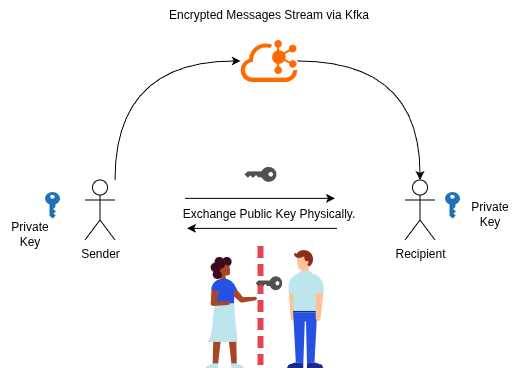

**Rahasak** (meaning "Secret" or "Whisper" in Sinhala) is a secure, end-to-end encrypted messaging platform designed to prioritize user privacy and trust. Unlike traditional messaging apps that rely on centralized servers for key distribution, Rahasak introduces a **novel physical key exchange protocol**, allowing users to establish trust offline before communicating.

Powered by **Java** and **Apache Kafka**, the system ensures high-throughput, real-time message routing without compromising security.

---

## 🚀 Key Features

- **End-to-End Encryption (E2EE):** All messages are encrypted on the sender's device and can only be decrypted by the recipient. The server (Kafka) never sees the plaintext.
- **Novel Physical Key Exchange:** A unique protocol that mandates users to share public keys via an offline medium (e.g., QR code, USB, local network) to eliminate Man-in-the-Middle (MITM) attacks during the initial handshake.
- **Real-Time Messaging:** Utilizes an **Apache Kafka** cluster for low-latency, scalable, and reliable message routing and delivery.
- **Zero-Knowledge Architecture:** The messaging broker stores only encrypted data and has no access to user private keys.

---

## 🛠️ Tech Stack

- **Language:** Java (Core logic and application)
- **Messaging Broker:** Apache Kafka
- **Encryption:** Asymmetric Encryption (RSA 2048/4096-bit)
- **Build Tools:** Maven / Gradle

---

## 🏗️ Architecture

Rahasak operates on a decentralized trust model while using a centralized backbone for data transport.

1.  **Client Application (Java):** Handles key generation (Public/Private key pair), encryption/decryption, and UI.
2.  **Key Exchange Phase:** Users manually exchange Public Keys offline. This establishes a "Web of Trust" without relying on a central Key Authority.
3.  **Message Transport (Kafka):**
    - **Producers:** Encrypt messages using the recipient's Public Key and publish to a recipient's Kafka topic.
    - **Consumers:** Subscribe to their his own topic, receive the encrypted payload, and decrypt it using their Private Key.

 

## 📖 Usage Guide

### Phase 1: Identity Creation & Key Exchange

Before messaging, you must establish a secure channel.

1.  Run the application. A unique **RSA Key Pair** (Public & Private) is generated locally.
2.  Export your **Public Key** (this does not contain sensitive data).
3.  Share this key with your intended contact via a **physical/offline method** (e.g., flash drive, QR code scan, or local file transfer).
4.  Import your contact's Public Key into your local keystore.

### Phase 2: Secure Messaging

1.  Compose a message.
2.  The app encrypts the text using the recipient's **Public Key**.
3.  The encrypted packet is sent to the Kafka cluster.
4.  The recipient polls the Kafka topic, downloads the packet, and decrypts it using their **Private Key**.

---

## 🔒 Security Protocol

Rahasak uses **Asymmetric Encryption (RSA)**.

The system relies on the mathematical relationship between keys:

- **Ciphertext:** The encrypted data sent over Kafka.
- **Public Key:** Shared offline and used strictly for Encryption.
- **Private Key:** Kept secret on the device and used strictly for Decryption.

By forcing the Public Key exchange to happen **offline**, Rahasak mitigates the risk of a compromised central server serving fake keys to intercept messages (a common vulnerability in centralized E2EE apps).

---

## 🔮 Future Roadmap

- [ ] Group Messaging facility
- [ ] Voice calls.
- [ ] Implementation of Hybrid Encryption (AES + RSA) for faster large-file transfers.
- [ ] Android/Mobile companion app.

---

## 👨‍💻 Author

**Your Name**

- **Year:** 2024 - 2026
- **GitHub:** [github.com/sathindudezoysa](https://github.com/sathindudezoysa)
